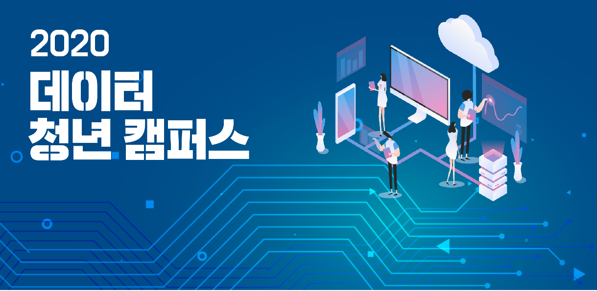

# 빅데이터 청년 인재

데이터 청년캠퍼스(KGU) 산업 빅데이터 분석 과정 교육 간에 학습한 내용을 정리하기 위한 저장소

## 주최 및 주관

* 과학기술정보통신부
* 한국데이터산업진흥원

## 산업 빅데이터 분석 전문가 과정

### - 과정 개요

* **운영 대학** : 경기대학교
* **과정 개요 및 특징**
  * 신한카드, 포스코, AI 스타트업과의 산학 프로젝트 진행
  * DS, DE 반의 두 종류의 커리큘럼의로 구성
  * 기초 수학 및 프로그래밍 강의를 통한 기초 이론 교육
* **교육인원** :  70명
* **교육 기간** : 2020-06-22 ~ 2020-09-19

### - 커리큘럼

|              교과목명              |                          주요 내용                           | 시간 |
| :--------------------------------: | :----------------------------------------------------------: | :--: |
| 데이터 분석을 위한 기초 프로그래밍 |        데이터 분석에 많이 사용되는 파이썬 프로그래밍         | 15H  |
|    데이터 분석을 위한 기초 수학    | 데이터 분석 기법 이해를 위한 선형대수, 최적화, 정보이론, 통계학 기초 이론 | 15H  |
|          데이터과학 기초           |                 데이터과학 소개 및 기초 이론                 |  5H  |
|   데이터 (전) 처리 이론 및 실습    |         데이터베이스, SQL, 데이터 타입 별 처리 방법          | 21H  |
|    머신러닝/딥러닝 이론 및 실습    |             머신러닝, 딥러닝 방법론 소개 및 실습             | 63H  |
|    빅데이터 플랫폼 이론 및 실습    |       빅데이터 처리를 위한 이론 및 Hadoop, Spark 등 툴       | 21H  |
|      최신 딥러닝 이론 및 실습      | GNN, GAN, Explainable AI, Transfer Learning 등 최신 딥러닝 이론 소개 및 실습 | 12H  |
|          스마트제조 개론           |               스마트제조 이해를 위한 기본 개념               | 15H  |
|     스마트 제조를 위한 AI 기법     | Reinforcement Learning, Genetic Algorithm 등 AI를 활용한 스마트제조 방법론 |  8H  |
|           산학 프로젝트            | 신한카드, 포스코 등 대기업과 ai.m, 오피니언라이브 등 AI 스타트업과의 산학 프로젝트 | 140H |

